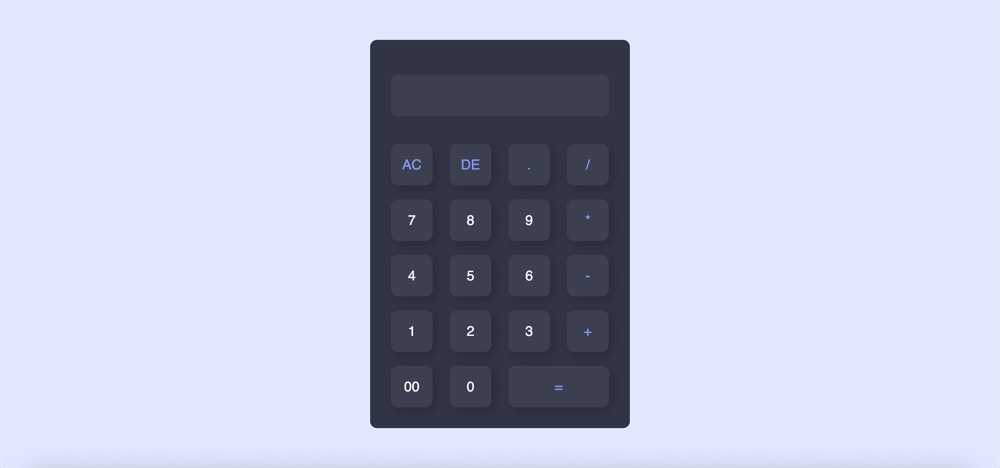

# 🧮 Calculator App

A simple and responsive calculator built using **HTML** and **CSS**.  
This project demonstrates basic UI styling, layout techniques, and browser-based interaction principles.

## 🚀 Features

✅ Clean and minimal user interface  
✅ Fully responsive layout  
✅ Interactive hover states  
✅ Smooth button styling  
✅ Lightweight and fast (no frameworks)

## 🛠️ Technologies Used

- HTML5
- CSS3

## 🖼️ Preview

Here is what the calculator looks like:

